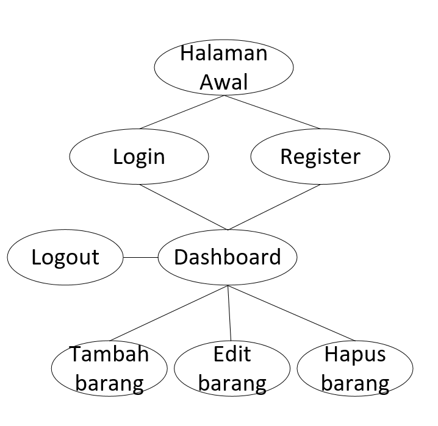

# Nama Aplikasi
Sistem Katalog Barang 

## Kegunaan Aplikasi
Sistem "Katalog Barang" ini adalah sebuah aplikasi web yang dirancang untuk membuat sebuah katalog barang yang memuat nama barang, kategori barang, deskripsi barang, harga barang, dan gambar barang.

## Flowchart
Berikut adalah flowchart yang menggambarkan alur kerja aplikasi:

## Perkenalan Tim
- Muhammad Gilang Febrian [mengerjakan backend app.py]
- Azfa Yashifa Ramadhan [tampilan dashboard]
- erwin ardian nugraha [tampilan login, tampilan registrasi]
- Khayruraya Abrar Julviansyah [tampilan tambah barang, tampilan edit barang]

## Link Video Dokumentasi
Anda dapat menonton video dokumentasi aplikasi melalui tautan berikut: [Klik Disini](https://youtu.be/A2Yf8whT_4E)
